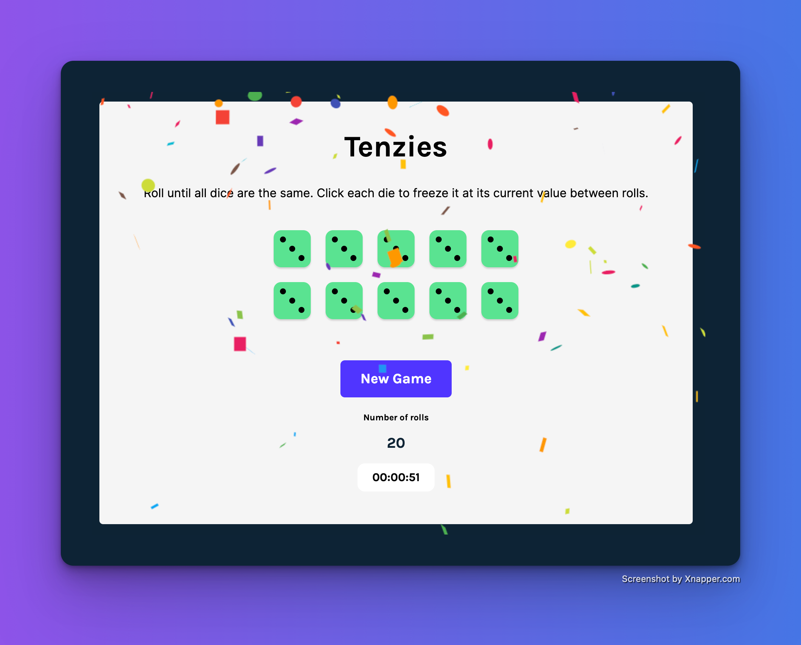

# Tenzies

Tenzies is a web-based dice game where the player rolls 10 dice until all of them show the same value. Each die can be held by clicking on it, causing it to be frozen at its current value for the next roll. The game includes a timer and celebrates the player's victory with confetti.

[Tenzies START](./public/demo/demo-01.png)

## Game Play

The game begins with the player rolling 10 dice. After each roll, the player can choose which dice to hold and which to re-roll. The goal is to get all 10 dice to show the same value. If the player achieves this, a message appears on the screen announcing that they have won, and confetti rains down from the top of the screen.

The game includes a timer that starts as soon as the player begins rolling the dice. The timer displays the amount of time that has elapsed since the game began, in hours, minutes, and seconds.

## Technologies and Libraries Used

The game was developed using the following technologies and libraries:

- React: a JavaScript library for building user interfaces.
- nanoid: a small, secure, URL-friendly unique ID generator.
- Confetti: a React component for displaying confetti animations.

## Running the App

To play the game, follow this [Tenzies](https://tenzies-hathon.netlify.app/).

## Contributing

Contributions to the project are welcome and encouraged. If you find a bug, have an idea for a new feature, or want to improve the code, feel free to submit a pull request.

## License

This project is licensed under the MIT License - see the [LICENSE.md](http://license.md/) file for details.
